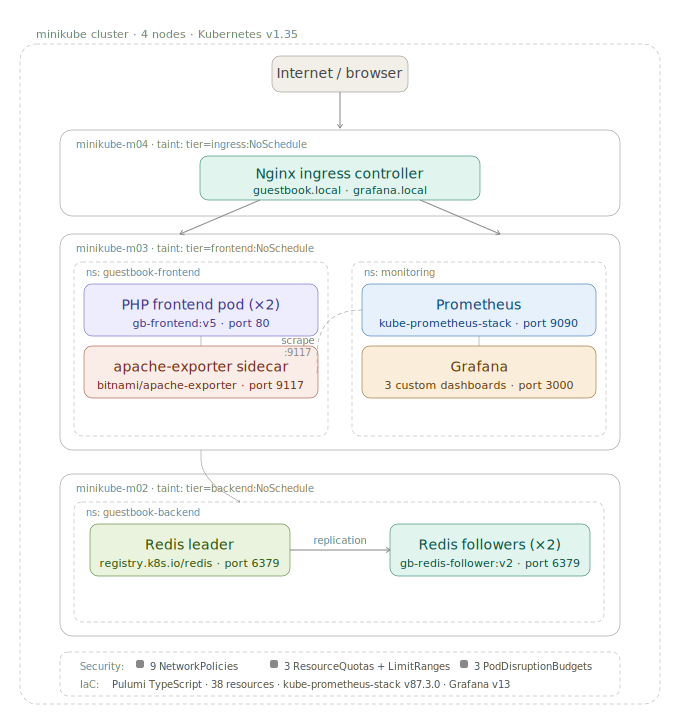

# Guestbook Application with Prometheus & Grafana Monitoring



A production-grade Kubernetes deployment of the Guestbook application, extended with full observability — Prometheus metrics, Grafana dashboards, Apache sidecar exporter, and security hardening. Deployed via **Pulumi TypeScript IaC** on a 4-node Minikube cluster with node isolation.

---

## Quick Start (Pulumi — recommended)

```bash
# 1. clone and enter the project
git clone <repo-url> && cd kubernetes-guestbook-monitoring

# 2. start the cluster and configure nodes
minikube start --nodes=4 --driver=docker --cpus=4 --memory=6144
minikube addons enable ingress metrics-server
kubectl label node minikube-m02 tier=backend && kubectl taint node minikube-m02 tier=backend:NoSchedule
kubectl label node minikube-m03 tier=frontend && kubectl taint node minikube-m03 tier=frontend:NoSchedule
kubectl label node minikube-m04 tier=ingress  && kubectl taint node minikube-m04 tier=ingress:NoSchedule

# 3. patch ingress to dedicated node
kubectl patch deployment ingress-nginx-controller -n ingress-nginx --type=json \
  -p='[{"op":"replace","path":"/spec/template/spec/nodeSelector","value":{"kubernetes.io/os":"linux","tier":"ingress"}}]'
kubectl patch deployment ingress-nginx-controller -n ingress-nginx \
  --patch '{"spec":{"template":{"spec":{"tolerations":[{"key":"tier","operator":"Equal","value":"ingress","effect":"NoSchedule"}]}}}}'

# 4. deploy everything with Pulumi
cd pulumi-guestbook
npm install
pulumi stack init dev
pulumi config set grafanaPassword admin123
pulumi up --yes

# 5. add local DNS
echo "192.168.49.5 guestbook.local grafana.local" | sudo tee -a /etc/hosts
```

**That's it.** Open `http://guestbook.local` for the app and `http://grafana.local` for dashboards.

---

## Grafana Access

| | |
|---|---|
| URL | http://grafana.local |
| Username | `admin` |
| Password | `admin123` |
| Home dashboard | Guestbook — Full Stack Overview (auto-loads on login) |

---

## Architecture

```
minikube        → control plane
minikube-m02    → guestbook-backend   (Redis leader + 2 followers)
minikube-m03    → guestbook-frontend  (PHP app + apache-exporter sidecar) + monitoring
minikube-m04    → ingress-nginx       (Nginx ingress controller)
```

| Namespace | Contents |
|---|---|
| `guestbook-backend` | Redis leader + followers |
| `guestbook-frontend` | PHP frontend + apache-exporter sidecar (port 9117) |
| `monitoring` | Prometheus + Grafana + Alertmanager + node-exporters |
| `ingress-nginx` | Nginx ingress controller |

---

## What Pulumi Deploys (38 resources)

| Category | Resources |
|---|---|
| Namespaces | guestbook-backend, guestbook-frontend, monitoring |
| Guestbook | Redis leader + follower deployments + services, PHP frontend + service |
| Monitoring | kube-prometheus-stack Helm release (Prometheus + Grafana + Alertmanager) |
| Scraping | ServiceMonitor for frontend (port 9117) + ServiceMonitor for Redis |
| Ingress | guestbook-ingress, grafana-ingress |
| Dashboards | 3 Grafana dashboard ConfigMaps (auto-loaded by sidecar) |
| Security | 3 LimitRanges, 3 ResourceQuotas, 3 PodDisruptionBudgets, 9 NetworkPolicies, 2 Secrets |

---

## Verifying Prometheus Scraping

```bash
# port-forward to Prometheus
kubectl port-forward svc/prometheus-prometheus 9090:9090 -n monitoring

# open http://localhost:9090/targets
# look for: serviceMonitor/monitoring/frontend-monitor → 2/2 UP
```

Verify Apache metrics directly from the pod:
```bash
POD=$(kubectl get pods -n guestbook-frontend -o jsonpath='{.items[0].metadata.name}')
kubectl exec $POD -n guestbook-frontend -c php-redis -- curl -s http://localhost:9117/metrics | head -20
```

Expected output:
```
# HELP apache_accesses_total Current total apache accesses
apache_accesses_total 42
apache_workers{state="busy"} 2
apache_workers{state="idle"} 6
apache_cpuload 0.0012
```

---

## Grafana Dashboards

| Dashboard | Panels |
|---|---|
| Guestbook — Full Stack Overview | Pod counts, request rate, Apache workers, CPU/memory, restarts |
| Guestbook Frontend — Apache Metrics | Request rate, busy/idle workers, CPU load, replicas available |
| Kubernetes — Pod Resources | CPU and memory per pod across both namespaces |

Dashboards are loaded automatically via Grafana's sidecar watching for ConfigMaps with label `grafana_dashboard=1`. The overview dashboard is set as the Grafana home page via `grafana.ini`.

---

## Key Prometheus Queries

| Metric | Query |
|---|---|
| HTTP request rate | `rate(apache_accesses_total[5m])` |
| Apache busy workers | `apache_workers{state="busy"}` |
| Apache idle workers | `apache_workers{state="idle"}` |
| Apache CPU load | `apache_cpuload` |
| Pod memory | `container_memory_working_set_bytes{namespace="guestbook-frontend", pod=~"frontend-.*"}` |
| Pod CPU | `rate(container_cpu_usage_seconds_total{namespace="guestbook-frontend", pod=~"frontend-.*"}[5m])` |
| Redis pods running | `kube_pod_status_phase{namespace="guestbook-backend", phase="Running"}` |
| Frontend replicas | `kube_deployment_status_replicas_available{namespace="guestbook-frontend"}` |
| Pod restarts | `kube_pod_container_status_restarts_total{namespace=~"guestbook-frontend|guestbook-backend"}` |

---

## Security

```
Internet
    │
    ▼
ingress-nginx (minikube-m04)
    ├── :80   → guestbook-frontend  (allow-ingress-to-frontend)
    └── :3000 → monitoring/grafana  (allow-ingress-to-grafana)

guestbook-frontend
    └── :6379 → guestbook-backend   (allow-frontend-to-redis)
                Redis — default-deny blocks everything else

monitoring
    ├── :9117 → guestbook-frontend  (allow-monitoring-to-frontend)
    └── :any  → guestbook-backend   (allow-monitoring-to-backend)
                internal free communication (allow-intra-monitoring)
```

| Layer | Resource | Purpose |
|---|---|---|
| NetworkPolicy | default-deny-ingress (×3) | default-deny in every namespace |
| NetworkPolicy | allow-frontend-to-redis | only frontend reaches Redis on :6379 |
| NetworkPolicy | allow-monitoring-* | only Prometheus scrapes metrics endpoints |
| NetworkPolicy | allow-ingress-* | only Nginx reaches frontend and Grafana |
| LimitRange | backend / frontend / monitoring | inject default CPU/memory limits for all pods |
| ResourceQuota | backend / frontend / monitoring | cap total resource consumption per namespace |
| PodDisruptionBudget | redis-leader-pdb | leader protected — 0 voluntary disruptions allowed |
| PodDisruptionBudget | redis-follower-pdb | at least 1 follower always available |
| PodDisruptionBudget | frontend-pdb | at least 1 frontend pod always serving |
| Secret | grafana-credentials, redis-credentials | credentials in K8s secrets, not hardcoded |

---

## How Metrics Flow

```
Apache (PHP pod)
  └── mod_status → /server-status?auto
        └── apache-exporter sidecar reads it
              └── exposes Prometheus metrics on :9117
                    └── ServiceMonitor tells Prometheus to scrape :9117
                          └── Prometheus stores time-series data
                                └── Grafana queries Prometheus
                                      └── ConfigMap dashboards auto-load via sidecar
                                            └── live charts in the browser
```

---

## Prerequisites

- Docker
- `minikube` v1.38+
- `kubectl`
- `helm` (Approach A only)
- Node.js 20+ and `npm` (Approach B only)
- Pulumi CLI (Approach B only)

---

## Approach A — Manual Deployment (kubectl + helm)

> For learning and understanding each component individually.

### A1 — Create namespaces

```bash
kubectl create namespace guestbook-backend
kubectl create namespace guestbook-frontend
kubectl create namespace monitoring
```

### A2 — Deploy guestbook

```bash
cd k8s/
kubectl apply -f BackEnd/Redis-Leader-Deployment.yaml
kubectl apply -f SVC-Redis-Leader.yaml
kubectl apply -f BackEnd/Redis-Follower-Deployment.yaml
kubectl apply -f SVC-Redis-Follower.yaml
kubectl apply -f FrontEnd/Front-Deploy.yaml
kubectl apply -f FrontEnd/Frontend-service.yaml
```

### A3 — Create ingress and DNS

```bash
kubectl apply -f ingress.yaml
echo "192.168.49.5 guestbook.local grafana.local" | sudo tee -a /etc/hosts
curl -I http://guestbook.local   # Expected: HTTP 200 OK
```

### A4 — Deploy monitoring stack

```bash
helm repo add prometheus-community https://prometheus-community.github.io/helm-charts
helm repo update
helm install kube-prometheus-stack prometheus-community/kube-prometheus-stack \
  --namespace monitoring \
  --values Monitoring/kube-prometheus-stack-values.yaml \
  --wait --timeout 15m
```

### A5 — Apply ServiceMonitors

```bash
kubectl apply -f Monitoring/servicemonitor-frontend.yaml
kubectl apply -f Monitoring/servicemonitor-redis.yaml
```

### A6 — Load Grafana dashboards

```bash
cd Monitoring/DashBoard-json/
for dashboard in *.json; do
  name=$(basename $dashboard .json)
  kubectl create configmap $name \
    --from-file=$dashboard --namespace monitoring \
    --dry-run=client -o yaml | \
    kubectl label --local -f - grafana_dashboard=1 -o yaml | \
    kubectl apply -f -
done
```

### A7 — Apply security hardening

```bash
kubectl apply -f Security/secrets.yaml
kubectl apply -f Security/resource-quotas.yaml
kubectl apply -f Security/pod-disruption-budgets.yaml
kubectl apply -f Security/network-policies.yaml
```

### A8 — Verify

```bash
kubectl get pods -n guestbook-backend -o wide   # minikube-m02
kubectl get pods -n guestbook-frontend -o wide  # minikube-m03
kubectl get pods -n monitoring -o wide          # minikube-m03
kubectl get pods -n ingress-nginx -o wide       # minikube-m04
curl -I http://guestbook.local                  # HTTP 200 OK
curl -I http://grafana.local                    # HTTP 302 Found
```

---

## Approach B — Pulumi Deployment (TypeScript IaC)

> The entire stack in a single `index.ts` file. One command to deploy everything.

### B1 — Install Pulumi

```bash
curl -fsSL https://get.pulumi.com | sh && source ~/.bashrc
```

### B2 — Deploy

```bash
cd pulumi-guestbook/
npm install
pulumi login
pulumi stack init dev
pulumi config set grafanaPassword admin123
pulumi up --yes
```

Stack outputs after deployment:
```
frontendUrl          : "http://guestbook.local ..."
grafanaUrl           : "http://grafana.local ..."
grafanaAdminUser     : "admin"
grafanaAdminPassword : "admin123"
addHostsCommand      : "echo '192.168.49.5 ...' | sudo tee -a /etc/hosts"
verifyScrapingCommand: "kubectl port-forward svc/prometheus-prometheus 9090:9090 -n monitoring"
verifyMetricsCommand : "POD=$(kubectl get pods ...) && kubectl exec ..."
```

### B3 — Add local DNS

```bash
echo "192.168.49.5 guestbook.local grafana.local" | sudo tee -a /etc/hosts
```

> Use `192.168.49.5` (minikube-m04 IP) — not `minikube ip` which returns the control plane.

### B4 — Verify

```bash
curl -I http://guestbook.local   # HTTP 200 OK
curl -I http://grafana.local     # HTTP 302 Found → login
```

### B5 — Destroy

```bash
pulumi destroy --yes
minikube delete
```

---

## File Structure

```
guestbook-monitoring/
├── architecture.svg
├── README.md
├── pulumi-guestbook/
│   ├── index.ts                 ← entire stack (38 resources)
│   ├── Pulumi.yaml
│   └── package.json
└── k8s/
    ├── BackEnd/
    │   ├── Redis-Leader-Deployment.yaml
    │   └── Redis-Follower-Deployment.yaml
    ├── FrontEnd/
    │   ├── Front-Deploy.yaml    ← php-redis + apache-exporter sidecar
    │   └── Frontend-service.yaml
    ├── Monitoring/
    │   ├── kube-prometheus-stack-values.yaml
    │   ├── servicemonitor-frontend.yaml
    │   ├── servicemonitor-redis.yaml
    │   └── DashBoard-json/
    │       ├── apache-frontend-dashboard.json
    │       ├── guestbook-overview-dashboard.json
    │       ├── kubernetes-pods-dashboard.json
    │       ├── network-connectivity-dashboard.json
    │       └── redis-sync-dashboard.json
    ├── Security/
    │   ├── network-policies.yaml
    │   ├── resource-quotas.yaml
    │   ├── pod-disruption-budgets.yaml
    │   └── secrets.yaml
    ├── SVC-Redis-Leader.yaml
    ├── SVC-Redis-Follower.yaml
    └── ingress.yaml
```
